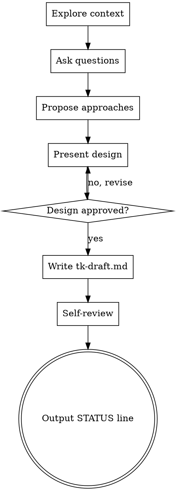

# Brainstorming Ideas Into Designs

Turn feature requests into fully formed designs through collaborative dialogue.

<HARD-GATE>
Do NOT invoke any implementation skill, write any code, or take implementation actions until you have presented a design and received STATUS: APPROVED. This applies to EVERY feature regardless of perceived simplicity.
</HARD-GATE>

## Checklist

You MUST complete these steps in order:

1. **Explore project context** — check CLAUDE.md, recent commits, related files
2. **Ask clarifying questions** — one at a time, understand purpose/constraints/success criteria
3. **Propose 2-3 approaches** — with trade-offs and your recommendation
4. **Present design** — in sections scaled to complexity, get approval after each section
5. **Write design doc** — save to `.pipeline/<feature>/tk-draft.md`
6. **Self-review** — check for placeholders, contradictions, ambiguity

## Process Flow



## Understanding the Idea

- Read CLAUDE.md and recent commits first
- Assess scope: if multiple independent subsystems, flag immediately for decomposition
- Ask one question per message
- Prefer multiple choice when possible
- Focus on: purpose, constraints, success criteria, acceptance tests

## Exploring Approaches

- Propose 2-3 different approaches with trade-offs
- Lead with your recommendation and explain why
- Include: effort estimate, risk assessment, dependencies

## Presenting the Design

Scale each section to complexity:
- **Architecture** — how components fit together
- **Data Model** — schemas, types, relationships
- **API Surface** — endpoints, methods, parameters
- **Error Handling** — what can fail, how to handle
- **Testing Strategy** — what to test, how

## Design for Isolation

- Each unit has one clear purpose
- Components communicate through well-defined interfaces
- Units can be understood and tested independently
- Smaller units are easier to implement and review

## tk-draft.md Format

```markdown
# Feature: <name>

## Summary
<1-2 sentences>

## Goal
<What problem does this solve?>

## Acceptance Criteria
- [ ] Criterion 1
- [ ] Criterion 2

## Architecture
<How components fit together>

## Data Model
<Schemas, types>

## API Surface
<Endpoints, methods>

## Error Handling
<What can fail, how to handle>

## Testing Strategy
<What to test, how>

## Open Questions
<Anything unresolved>

STATUS: READY_FOR_ARCHITECT_PLANNER
```

## Red Flags - STOP

- "This is too simple for a design" — No. Every feature gets design.
- "I'll figure it out during implementation" — No. Design first.
- "The user wants it fast" — Design is faster than rework.

## Output

Last line MUST be one of:
- `STATUS: READY_FOR_ARCHITECT_PLANNER` — Design complete, proceed
- `STATUS: BLOCKED_NEEDS_CLARIFICATION` — Cannot proceed without user input
